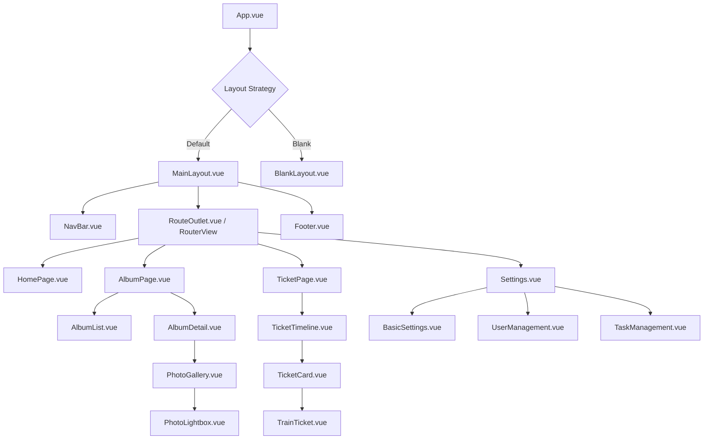
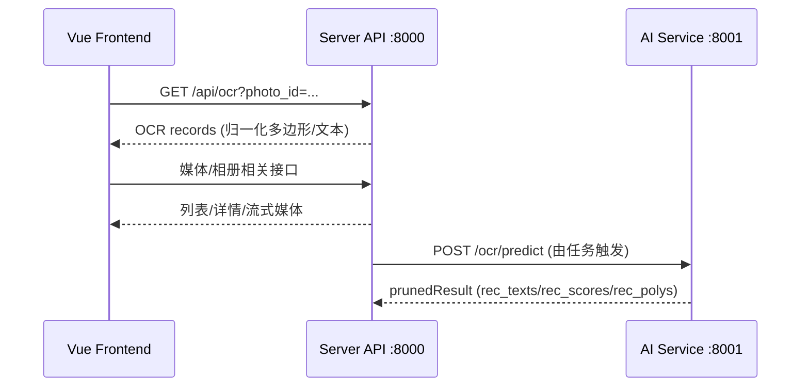

# 前端框架分析文档

## 1. 技术栈拆解

### 1.1 核心框架
项目使用 **Vue 3** (`^3.5.13`) 作为核心框架，采用 Composition API 提供灵活的逻辑复用能力；配合 **TypeScript** (`^5.9.3`) 提供静态类型检查，增强代码健壮性；构建工具为 **Vite** (`^6.2.0`)。

### 1.2 UI 组件库与样式
- **Element Plus**: 作为主要的基础组件库，提供按钮、表单、对话框等通用组件。
- **TailwindCSS**: 用于原子化 CSS 样式开发，提供灵活的布局和响应式设计能力，减少编写自定义 CSS 的需求。
- **图标**: 使用 `lucide-vue-next` 和 `mingcute_icon` 提供现代化的矢量图标。

### 1.3 状态与路由管理
- **Pinia**: 取代 Vuex 成为新一代状态管理工具，提供更简洁的 API 和更好的 TypeScript 支持。主要 Store 包括：
  - `albumStore`: 管理相册列表和详情。
  - `photoStore`: 管理照片数据和浏览状态。
  - `ticketStore`: 管理车票和行程数据。
- **Vue Router**: 处理单页应用 (SPA) 的路由跳转，支持嵌套路由和导航守卫。

### 1.4 数据交互
- **Axios**: 封装 HTTP 请求，配合 `src/utils/request.ts` 进行拦截器配置（统一处理 Token、错误响应）。
- **API 层**: `src/api` 目录将接口调用按模块封装，与业务逻辑解耦。

### 1.5 版本与依赖来源
前端依赖版本以 `package/website/package.json` 为准：
- `vue ^3.5.13`、`vite ^6.2.0`、`typescript ^5.9.3`
- `element-plus ^2.11.9`、`tailwindcss 3.4.17`
- `pinia ^3.0.3`、`vue-router ^4.5.0`
- `axios ^1.12.2`、`echarts ^6.0.0`
- 其他：`@vueuse/core ^14.0.0`、`video.js ^8.23.4` 等

## 2. 前端组件层级关系

## 3. 性能指标与优化分析

### 3.1 现有性能特性
- **按需引入**: Element Plus 和图标库通常支持按需引入，减少包体积。
- **虚拟列表**: `composables/useVirtualLayout.ts` 表明项目中已实现或计划实现虚拟滚动，这对于展示大量照片（瀑布流）或长列表至关重要，能显著减少 DOM 节点数量，提升渲染性能。
- **响应式布局**: 利用 TailwindCSS 实现多端适配，避免了针对不同设备加载不同代码的冗余。

### 3.2 优化空间
1. **图片加载优化**:
   - 瀑布流布局应配合后端提供的缩略图接口，避免直接加载原图。
   - 实现图片懒加载 (Lazy Loading)，仅当图片进入视口时才加载。
2. **代码分割 (Code Splitting)**:
   - 路由懒加载：确保 `router/index.ts` 中使用 dynamic import (`() => import(...)`) 加载组件，减小首屏包体积。
3. **构建优化**:
   - 利用 Vite 的构建特性，配置合理的 `splitVendorChunkPlugin` 或自定义 `rollupOptions` 将第三方库分包缓存。
4. **状态管理优化**:
   - 避免 Store 过于庞大，合理拆分 Store 模块。
   - 确保 Store 中的数据仅在需要时更新，减少不必要的组件重渲染。
5. **交互与绘制优化**:
   - OCR 多边形绘制建议使用 `requestAnimationFrame` 批量刷新，减少频繁重排。
   - 对于大图预览，采用 `object-fit` 与 CSS 硬件加速 (`will-change: transform`) 提升滚动与缩放体验。

## 4. 前端与后端交互示意

