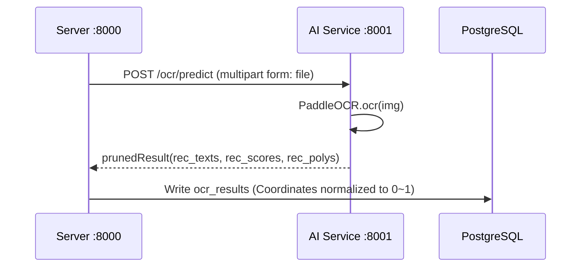

# Backend Framework Analysis Document

## 1. Tech Stack Detailed Description

### 1.1 Core Framework
- **FastAPI** (Server): High-performance asynchronous Web framework, providing automated OpenAPI documentation (`/docs`).
- **Uvicorn**: ASGI server, running FastAPI applications.
- **Pydantic**: Request/Response models and data validation.

### 1.2 Data Persistence
- **PostgreSQL**: Main database.
- **SQLAlchemy (Async)**: ORM framework, interacting with the database using asynchronous mode (`AsyncSession`) to improve concurrency processing capabilities.
- **Alembic**: Database version control tool, used for handling Schema change migrations.

### 1.3 Asynchronous Tasks & Services
- **APScheduler**: Used for scheduled task scheduling (although the code mainly uses custom TaskManager, the library is included in the dependency list and may be used for periodic tasks).
- **TaskManager**: Custom task manager (`app/service/task_manager.py`), used for handling time-consuming operations, such as:
  - Photo scanning and indexing
  - Thumbnail generation
  - Metadata extraction
  - OCR recognition tasks

### 1.4 AI & Image Processing
- **PaddleOCR** (AI Microservice): Text detection and recognition, supporting `rec_texts/rec_scores/rec_polys` output.
- **InsightFace** (AI Microservice): Face detection/key points/feature extraction.
- **YOLO (Ultralytics)**: Independent server-side script for ticket area detection and cropping.
- **OpenCV**: Image decoding and basic processing.

## 2. Service Module Division & Call Relationship

```mermaid
graph TD
    Request[Client Request] --> Middleware[Middleware (Logging/CORS)]
    Middleware --> Router[API Routers]
    
    subgraph Modules [Functional Modules]
        Router --> UserMod[User Module]
        Router --> AlbumMod[Album Module]
        Router --> PhotoMod[Photo Module]
        Router --> TaskMod[Task Module]
        Router --> RailwayMod[Railway Module]
    end
    
    subgraph Services [Business Service Layer]
        PhotoMod --> StorageSvc[Storage Service]
        PhotoMod --> IndexerSvc[Indexer Service]
        TaskMod --> TaskMgr[Task Manager]
        TaskMgr --> Workers[Worker Threads/Processes]
    end
    
    subgraph External [External Dependencies]
        Workers --> AI_Svc[AI Service :8001]
        Workers --> FileSys[File System]
        StorageSvc --> FileSys
    end
    
    subgraph Data [Data Layer]
        UserMod --> CRUD[CRUD Operations]
        AlbumMod --> CRUD
        PhotoMod --> CRUD
        CRUD --> DB[(PostgreSQL)]
    end
```

### 2.2 AI Microservice Call Chain



### 2.1 Key Module Analysis
- **API Routers (`app/api`)**: Controller layer, handles HTTP requests, parameter validation, calls Service or CRUD layer.
- **CRUD Layer (`app/crud`)**: Data access layer, encapsulates all database interaction logic, keeping business logic pure.
- **Service Layer (`app/service`)**: Business logic layer, handles complex business, such as file system operations, calling AI models, background task management.

## 3. API Design Specifications & Status

### 3.1 Specifications
- **RESTful Style**: Interface design follows resource orientation, such as `GET /albums` to get list, `POST /albums` to create album.
- **Response Format**: Use Pydantic models to define Response Schema, ensuring consistent return data structure.
- **Status Codes**: Follow HTTP standard status codes (200 Success, 201 Created, 400 Request Error, 401 Unauthorized, 404 Not Found, 500 Server Error).

### 3.2 Interface Document Status
- **Swagger UI**: FastAPI automatically generates interactive documentation, address is usually `/docs`.
- **ReDoc**: Another style of documentation, address is usually `/redoc`.
- **Main Resources**:
  - `/users`: User related.
  - `/albums`: Album CRUD.
  - `/photos`: Photo upload, streaming acquisition, metadata management.
  - `/tasks`: Task status query, task triggering.
  - `/settings`: System configuration management.
  - `/faces`: Face entity and photo management.
  - `/ocr`: OCR recognition record query (`GET /ocr?photo_id=...`).
  - `/train-ticket`: Train ticket CRUD and export.
  - `/railway`: Railway station and operation plan interfaces.

### 3.3 Logs & Exceptions
- **Logs**: JSON queue log + daily capacity rolling; each record contains `timestamp/level/message/operation/params/result`.
- **Exceptions**: Unified capture and write to log; AI call failure or image decoding error will return corresponding error code and record.

### 3.4 Data Model Description (Example)
- **OCR Result** (Table `ocr_results`):
  - `text: str`, `text_score: float`, `polygon: List[List[float]]` (Coordinates normalized to 0~1)
  - Query Interface: `GET /ocr?photo_id=<uuid>` returns list of records
