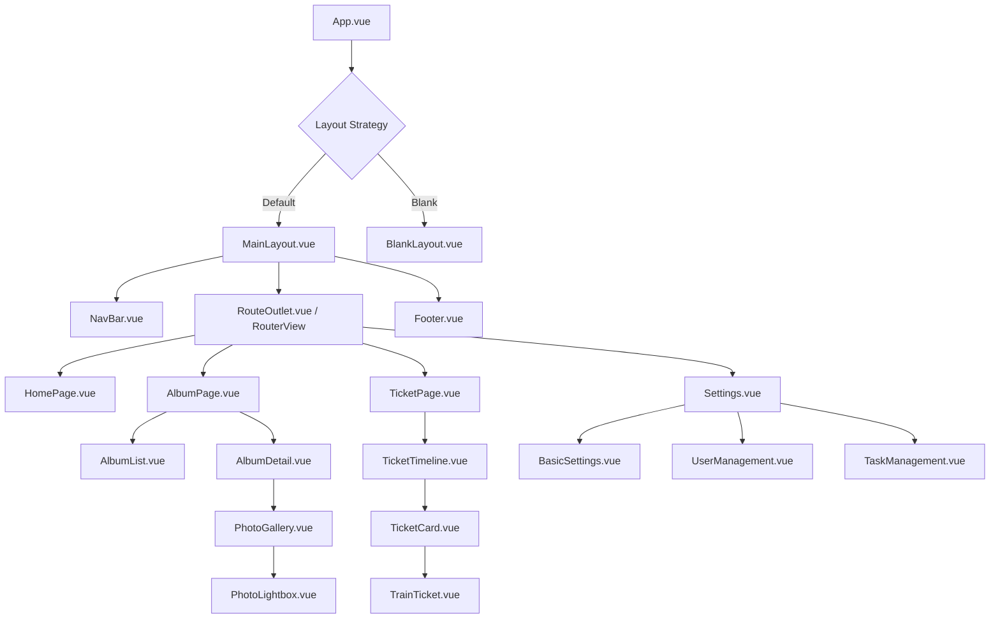
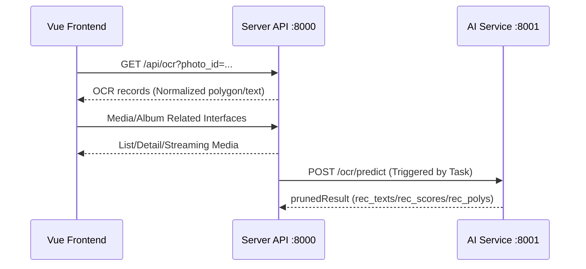

# Frontend Framework Analysis Document

## 1. Tech Stack Breakdown

### 1.1 Core Framework
The project uses **Vue 3** (`^3.5.13`) as the core framework, adopting Composition API to provide flexible logic reuse capabilities; coupled with **TypeScript** (`^5.9.3`) to provide static type checking and enhance code robustness; the build tool is **Vite** (`^6.2.0`).

### 1.2 UI Component Library & Styling
- **Element Plus**: As the main basic component library, providing general components such as buttons, forms, and dialogs.
- **TailwindCSS**: Used for atomic CSS style development, providing flexible layout and responsive design capabilities, reducing the need to write custom CSS.
- **Icons**: Uses `lucide-vue-next` and `mingcute_icon` to provide modern vector icons.

### 1.3 State & Route Management
- **Pinia**: Replaces Vuex as the new generation state management tool, providing a more concise API and better TypeScript support. Main Stores include:
  - `albumStore`: Manages album lists and details.
  - `photoStore`: Manages photo data and browsing status.
  - `ticketStore`: Manages tickets and itinerary data.
- **Vue Router**: Handles Single Page Application (SPA) route transitions, supporting nested routes and navigation guards.

### 1.4 Data Interaction
- **Axios**: Encapsulates HTTP requests, configured with interceptors in `src/utils/request.ts` (unified processing of Token, error responses).
- **API Layer**: The `src/api` directory encapsulates interface calls by module, decoupling them from business logic.

### 1.5 Versions & Dependency Sources
Frontend dependency versions are based on `package/website/package.json`:
- `vue ^3.5.13`, `vite ^6.2.0`, `typescript ^5.9.3`
- `element-plus ^2.11.9`, `tailwindcss 3.4.17`
- `pinia ^3.0.3`, `vue-router ^4.5.0`
- `axios ^1.12.2`, `echarts ^6.0.0`
- Others: `@vueuse/core ^14.0.0`, `video.js ^8.23.4`, etc.

## 2. Frontend Component Hierarchy

## 3. Performance Metrics & Optimization Analysis

### 3.1 Existing Performance Features
- **On-demand Import**: Element Plus and icon libraries usually support on-demand import, reducing bundle size.
- **Virtual List**: `composables/useVirtualLayout.ts` indicates that virtual scrolling has been implemented or planned in the project, which is crucial for displaying large numbers of photos (waterfall flow) or long lists, significantly reducing the number of DOM nodes and improving rendering performance.
- **Responsive Layout**: Utilizing TailwindCSS to achieve multi-terminal adaptation, avoiding redundancy of loading different codes for different devices.

### 3.2 Optimization Space
1. **Image Loading Optimization**:
   - Waterfall flow layout should coordinate with the thumbnail interface provided by the backend to avoid loading original images directly.
   - Implement Image Lazy Loading, loading only when the image enters the viewport.
2. **Code Splitting**:
   - Route Lazy Loading: Ensure that dynamic import (`() => import(...)`) is used in `router/index.ts` to load components, reducing the first screen bundle size.
3. **Build Optimization**:
   - Utilize Vite's build features, configure reasonable `splitVendorChunkPlugin` or custom `rollupOptions` to cache third-party libraries separately.
4. **State Management Optimization**:
   - Avoid overly large Stores, split Store modules reasonably.
   - Ensure that data in the Store is updated only when necessary, reducing unnecessary component re-rendering.
5. **Interaction & Drawing Optimization**:
   - OCR polygon drawing is recommended to use `requestAnimationFrame` for batch refreshing, reducing frequent reflows.
   - For large image preview, use `object-fit` and CSS hardware acceleration (`will-change: transform`) to improve scrolling and zooming experience.

## 4. Frontend & Backend Interaction Diagram

